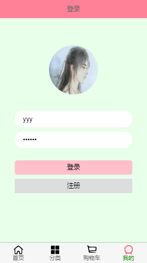

## Eternal flower 移动端购物商城
### 项目介绍
#### 基于Vue2+Vuex+Vue-router+Axios+webpack+ES6+PHP+MySQL技术搭建的移动端项目

#### 开发者 从前有只羊

#### 项目地址 https://github.com/myTerritory/Eternal_Flower

### 界面

       
```
npm run build
```

### Run your tests
```
npm run test
```

### Lints and fixes files
```
npm run lint
```

### Customize configuration
See [Configuration Reference](https://cli.vuejs.org/config/).
