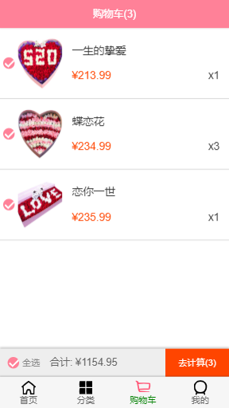

## Eternal flower 移动端购物商城
### 项目介绍
#### 基于Vue2+Vuex+Vue-router+Axios+webpack+ES6+PHP+MySQL技术搭建的移动端项目

#### 开发者 从前有只羊

#### 项目地址 https://github.com/myTerritory/Eternal_Flower

### 界面
#### 项目所有的界面都是自己设计的， 当然肯定有参考因素存在。

       

### 安装&构建

#### 安装依赖
npm install

#### 开发环境
npm run serve

#### 打包项目
npm run build

### 项目目录

### 另：已附上MySQL数据库，详情参考mydata.mssql文件 
See [Configuration Reference](https://cli.vuejs.org/config/).
